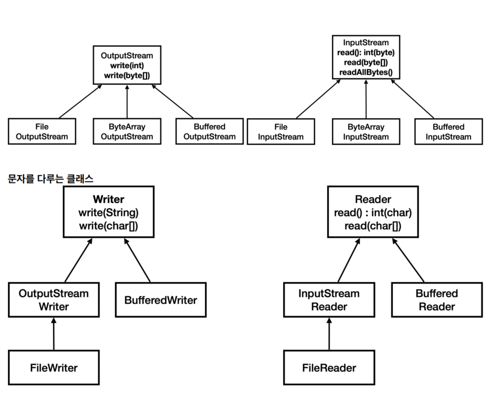
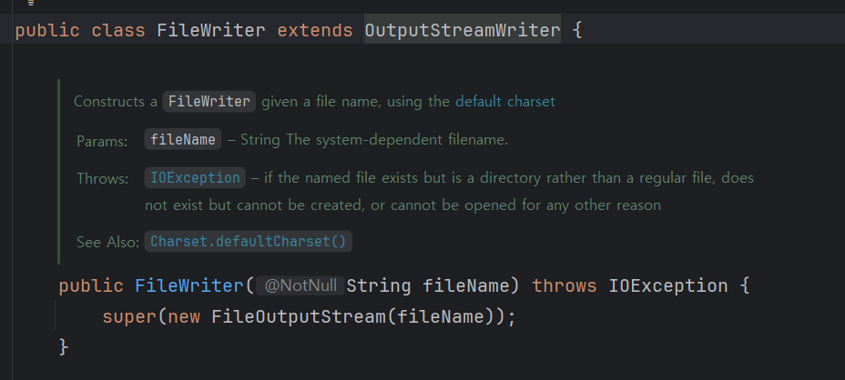

<h4>문자 인코딩</h4>

- 한글이 깨지는 가장 큰 2가지 이유
  - EUC-KR(MS949), UTF-8이 서로 호환되지 않음
  - 한글이 깨지는 대부분의 문제는 UTF-8로 인코딩한 한글을 EUC-KR(MS949)로 디코딩하거나 또는 EUC-KR(MS949)로 인코딩한 한글을 UTF-8로 디코딩할 때 발생
  - EUC-KR(MS949) 또는 UTF-8로 인코딩한 한글을 ISO-8859-1 로 디코딩 할 때 EUC-KR(MS949) 또는 UTF-8로 인코딩한 한글을 한글을 지원하지 않는 ISO-8859-1 로 디코딩 할 때 발생
- UTF-8이 사실상 표준이 된 이유 2가지 생각해보자

<h4>IO</h4>

- InputStream, OutputStream -> 추상 클래스, 파일/소켓 등 모두 일관된 방식으로 데이터 주고 받도록 함
  - 스트림은 byte 만 사용할 수 있으므로, String 과 같은 문자는 직접 전달할 수 는 없다 -> Writer클래스가 변환 과정을 도와줌
    
    
  - FileWriter 는 사실 내부에서 스스로 FileOutputStream 을 하나 생성해서 사용
- 기본(기반, 메인) 스트림
  - File, 메모리, 콘솔등에 직접 접근, 단독 사용 가능
- 보조 스트림
  - 기본 스트림을 도와주는 스트림, 대상 스트림 있어야함
- 객체 직렬화의 대안으로 왜 JSON이 선택 되었는지 생각해보자
- 절대 경로
  - 경로의 처음부터 내가 입력한 모든 경로를 다 표현
  - 여러가지 방법으로 표현 가능
- 정규 경로
  - 경로의 계산이 모두 끝난 경로. 정규 경로는 하나만 존재

<h4>파일</h4>

- Files
  - File 클래스 기능 개선
  - 복잡한 스트림 클래스 사용할 필요 없이 문자 파일 다루기 도와줌 (내부적으로 스트림 사용)
  - Path -> 경로 다루기
  - 파일을 다루어야 할 일이 있다면 항상 Files 의 기능을 먼저 찾아보자
  - 파일의 정보를 읽어서 처리해야 하거나, 스트림을 통해 네트워크에 전달해야 한다면 앞서 설명한 스트림을 직접 사용

<h4>네트워크</h4>

- Socket
  - 클라이언트와 서버의 연결에 사용되는 연결점 객체
  - IP 주소
    - 자바의 InetAddress 클래스를 사용하면 호스트 이름으로 대상 IP를 찾을 수 있다
    - 시스템의 호스트 파일을 먼저 확인 -> DNS서버에 요청해서 IP주소 얻는다
  - 클라이언트와 서버간의 데이터 통신은 Socket이 제공하는 스트림을 사용
  - ServerSocket
    - 서버 소켓은 단지 클라이언트와 서버의 TCP 연결만 지원하는 특별한 소켓
    - 서버가 12345 포트로 서버 소켓을 열어둔다. 클라이언트는 이제 12345 포트로 서버에 접속할 수 있다.
    - 클라이언트가 12345 포트에 연결을 시도한다. 이때 OS 계층에서 TCP 3 way handshake가 발생하고, TCP 연결이 완료.
    - TCP 연결이 완료되면 서버는 OS backlog queue라는 곳에 클라이언트와 서버의 TCP 연결 정보를 보관한다.
      - 이 연결 정보를 보면 클라이언트의 IP, PORT, 서버의 IP, PORT 정보가 모두 들어있다
    - 실제 클라이언트와 서버가 정보를 주고 받으려면 Socket 객체가 필요
    - serverSocket.accept() 메서드를 호출하면 TCP 연결 정보를 기반으로, Socket 객체를 만들어서 반환
      - accept() 를 호출하면 backlog queue에서 TCP 연결 정보를 조회
      - 먄약 TCP 연결 정보가 없다면, 연결 정보가 생성될 때 까지 대기한다. (블로킹)
    - 사용한 TCP 연결 정보는 backlog queue에서 제거
    - 소켓 객체 없이 서버 소켓만으로도 TCP 연결은 완료된다는 점에 주의하자 (서버 소켓은 연결만 담당한다)
    - 서버와 TCP 연결이 되면 서버로 메세지를 보낼 수는 있다.
    - 하지만 연결 이후에 서로 메시지를 주고 받으려면 서버에도 Socket 객체가 필요하다 (연결 요청하는 클라이언트 마다 각각)
- 자원 정리
  - ResourceCloseMainV1 : 비정상 로직 으로 예외가 발생하여 자원 정리가 호출 안되는 경우
  - ResourceCloseMainV2 : 두가지 핵심 문제 발생
    - close() 시점에 예외가 발생하면, 이후 다른 자원을 닫을 수 없는 문제 발생
    - finally 블럭 안에서 자원을 닫을 때 예외가 발생하면, 핵심 예외가 finally 에서 발생한 부가 예외로 바뀌어 버린다. 그리고 핵심 예외가 사라진다.
  - ResourceCloseMainV3 : 앞선 버전의 두가지 핵심 문제는 해결하지만, 여전한 4가지 부가 문제 존재
    - resource 변수를 선언하면서 동시에 할당할 수 없음( try , finally 코드 블록과 변수 스코프가 다른 문제)
    - catch 이후에 finally 호출, 자원 정리가 조금 늦어진다.
    - 개발자가 실수로 close() 를 호출하지 않을 가능성
    - 개발자가 close() 호출 순서를 실수, 보통 자원을 생성한 순서와 반대로 닫아야 함
  - ResourceCloseMainV4
    - 자원을 생성한 순서에 따라 반대로 닫아 주는 것 까지 해줌
    - try-with-resources 를 사용하는 중에 핵심 로직 예외와 자원을 정리하는 중에 발생하는 부가 예외가 모두 발생하면 -> 부가 예외는 핵심 예외안에 Suppressed 로 담아서 반환. 사용도 가능
    - try-with-resources 장점 정리해서 생각해보자
- 네트워크 프로그램 자원 정리
  - try-with-resources는 사용과 해제를 함께 묶어서 처리할 때 사용.
  - 생명주기가 다른 때(세션 종료 or 서버 종료)에 자원을 정리하고자 할 때는 어쩔 수 없이 finally를 통해서 정리해야 한다
  - 자원 정리를 할 때 세션 종료 방식이든 서버 종료 방식이든 일관성 있게 해주도록 두 방법 모두 close()메소드 사용하도록 하는게 자연스럽다
  - shutdownhook
    - 자바 프로세스가 종료될 때 자원 정리같은 종료 작업을 마무리하고 프로세스가 종료되도록 돕는 기능
    - 정상 종료의 경우 셧다운 훅 작동 / 강제 종료는 작동하지 않는다
- 네트워크 예외
  - 기본 예외들 외에도 TCP 연결 타임 아웃, 소켓 타임아웃(read 타임 아웃) 이 있음
  - 외부 서버와 통신을 하는 경우 반드시 연결 타임아웃과 소켓 타임아웃을 지정하자.
- 네트워크 종료
  - 정상 종료
    - 상대방이 연결을 종료한 경우 데이터를 읽으면 EOF가 발생한다.
      - -1, null , EOFException 등이 발생한다.
    - 소켓 연결을 끊어야 한다
  - 강제 종료
    - 서버는 이미 FIN으로 종료를 요청했는데, PUSH 패킷으로 데이터가 전송
      - 서버가 기대하는 값은 FIN 패킷이다.
      - 서버는 TCP 연결에 문제가 있다고 판단하고 즉각 연결을 종료하라는 RST 패킷을 클라이언트에 전송
    - java.net.SocketException: Connection reset
      - RST 패킷을 받은 이후에 read() 호출
    - java.net.SocketException: Broken pipe
      - RST 패킷을 받은 이후에 write() 호출
    - java.net.SocketException: Socket is closed
      - 자신이 소켓을 닫은 이후에 read() , write() 호출
- 채팅 프로그램
  - 세션은 왜 필요한지?
    - 클라이언트와 서버의 연결을 담당하는 스레드와 클라이언트의 메세지를 받고 처리를 하는 스레드를 분리해야함.
    - 분리하지 않으면 어떻게 될 지 생각해보자
    - 블로킹 메서드가 2개 이상 존재하면 클래스 분리의 신호일 수 있겠다.
  - 세션 매니저는 왜 필요한지?
    - 각 세션은 소켓과 연결 스트림을 가지고 있다. 따라서 서버를 종료할 때 사용하는 세션들도 함께 종료해야 한다.
    - 모든 세션들을 찾아서 종료하려면 생성한 세션을 보관하고 관리할 객체가 필요하다.
  - 핸들러는 왜 필요한지?
    - 콘솔에서의 입력을 스레드가 대기함
    - 서버에서 들어오는 메세지를 받으려고 계속 대기함
  - Null Object Pattern / Command Pattern
    - CommandManager의 HashMap 동시성 컬렉션 사용 안해도 되는 이유 생각해보자

<h4>http</h4>

- httpserver
  - HTTP 통신도 socket 통신을 사용. 대신에 HTTP 요청이 끝나면 해당 socket 통신을 끊어버리는 차이가 있다. (클라이언트가 서버로 요청을 보낼 때마다 새로운 소켓 연결이 이루어지고, 응답을 받은 후에는 즉시 연결이 종료되는 방식)
  - HTTP는 매우 보수적, 호환성을 최우선에 둠. -> URL엔 아스키만 가능 (메시지 바디에는 UTF8가능) -> 발생하는 문제 퍼센트인코딩으로 -> URLEncoder.encode() , URLDecoder.decode 를 사용하면 % 인코딩, 디코딩을 처리할 수 있다
  - HTTP, Server, Applet의 줄임말이다. (HTTP 서버에서 실행되는 작은 자바 프로그램(애플릿))
    - 이 인터페이스의 service() 메서드가 있는데, 여기에 서비스 개발과 관련된 부분을 구현하면 된다.
  - HTTP 서비스(프로젝트)를 만들어도 was.httpserver 부분의 코드를 그대로 재사용 할 수 있고, 또 전혀 변경하지 않아도 된다

<h4>리플랙션, 어노테이션</h4>

- 클래스가 제공하는 다양한 정보를 동적으로 분석하고 사용하는 기능을 리플렉션(Reflection)이라 한다.
  - 리플렉션을 통해 프로그램 실행 중에 클래스, 메서드, 필드 등에 대한 정보를 얻거나, 새로운 객체를 생성하고 메서드를 호출하며, 필드의 값을 읽고 쓸 수 있다
  - 스프링 프레임워크나 다른 프레임워크 기술들을 사용해보면, 내가 만든 클래스를 프레임워크가 대신 생성해 줄 때가 있다. -> 리플렉션과 동적 객체 생성 방법
- 애노테이션
  - 주석은 코드가 아니다. 따라서 컴파일 시점에 모두 제거된다.
  - 만약 프로그램 실행 중에 읽어서 사용할 수 있는 주석이 있다면 어떨까? 이것이 바로 애노테이션
  - 애노테이션을 정의하는데 사용하는 특별한 애노테이션을 메타 애노테이션
- 애노테이션과 상속
  - 애노테이션은 다른 애노테이션이나 인터페이스를 직접 상속할 수 없다. 오직 java.lang.annotation.Annotation 인터페이스만 상속
  - 따라서 애노테이션 사이에는 상속이라는 개념이 존재하지 않는다
  - 애노테이션을 정의할 때 @Inherited 메타 애노테이션을 붙이면, 애노테이션을 적용한 클래스의 자식도 해당 애노테이션을 부여 받을 수 있다.
    - 단 이 기능은 클래스 상속에서만 작동, 인터페이스의 구현에는 적용 X -> 왜 그런지 생각해보자
- 리플랙션 / 애노테이션
  - 프레임워크들은 리플렉션과 애노테이션을 활용하여 마법 같은 기능들을 제공
  - "마법"의 이면에는 리플렉션과 애노테이션을 활용한 복잡한 메타프로그래밍이 숨어 있다

### 고민했던 부분

- DataOutputStream 의 writeUTF도 블로킹 메서드 인가
  - DataInputStream.readUTF() (읽기 작업)
    - readUTF()는 네트워크(또는 파일)로부터 데이터를 받아와야 한다
    - 호출 시점에 읽을 데이터가 스트림에 존재하지 않으면, readUTF()는 해당 데이터가 도착할 때까지 호출 스레드를 블록
    - 네트워크 통신에서 이것은 "상대방으로부터 응답이 올 때까지" 기다리는 상황에 해당. 데이터가 완전히 읽히거나, 스트림의 끝(EOFException), 또는 I/O 오류가 발생할 때까지 반환되지 않는다.
  - DataOutputStream.writeUTF() (쓰기 작업)
    - writeUTF()는 데이터를 네트워크(또는 파일)로 보내야 한다.
    - writeUTF() 역시 블로킹 메서드. 이는 데이터를 기반 스트림에 완전히 쓰는 작업이 완료될 때까지 호출 스레드를 블록
    - 하지만 readUTF()처럼 "상대방의 응답"을 직접적으로 기다리는 것은 아니다.
    - writeUTF()가 블록되는 주요 이유:
      - 내부 버퍼가 가득 찼을 때: DataOutputStream은 내부 버퍼를 가질 수 있다. writeUTF()가 호출되었을 때 이 버퍼가 가득 차 있다면, 버퍼에 있는 데이터가 실제로 물리적인 출력 장치(네트워크 소켓, 파일 등)로 쓰여질 때까지 블록될 수 있다.
      - 기반 스트림의 쓰기 지연: 데이터를 쓰는 대상(예: 네트워크 소켓)이 현재 데이터를 받아들일 수 없는 상태이거나, 쓰기 작업 자체가 느린 경우(예: 네트워크 혼잡, 디스크 I/O 병목), writeUTF()는 이 쓰기 작업이 완료될 때까지 블록.
      - 즉, 데이터가 애플리케이션의 메모리에서 사라져 네트워크 스택 또는 운영체제 버퍼로 완전히 전달될 때까지 기다림