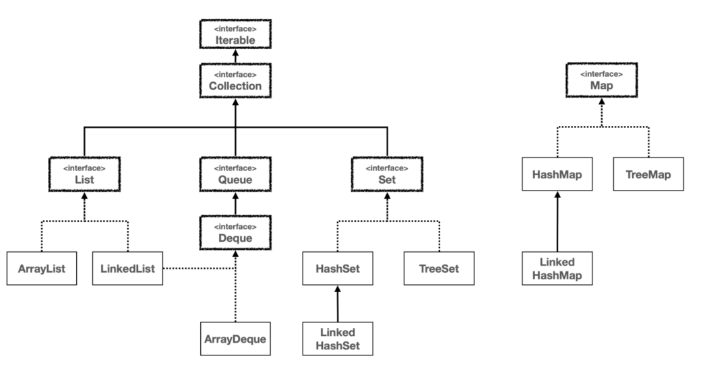

- 제네릭
  - 다양한 타입에 대해 동작하는 코드가 필요할 때 유용
  - 제네릭 타입
    - 클래스의 타입을 객체 생성시점에 결정짓도록 한다
    - 타입 안전성, 코드 재사용성 해결
    - 타입 매개변수 상한을 사용해서 타입 안전성을 지키면서 상위 타입의 원하는 기능까지 사용
  - 제네릭 메소드
    - 메소드에 따로 타임 파라미터를 명시해 줘야 한다
    - 제네릭 타입과 제네릭 메서드의 "타입 파라미터 ex T" 를 겹치도록 하지 않도록 설정하자
- 와일드 카드
  - 와일드카드는 제네릭 타입이나, 제네릭 메서드를 선언하는 것이 아니다. 와일드카드는 이미 만들어진 제네릭 타입을 활
    용할 때 사용
  - 제네릭 타입이나 제네릭 메서드를 정의하는게 꼭 필요한 상황이 아니라면, 더 단순한 와일드카드 사용을 권장
  - 제네릭 메서드 -> 전달한 타입 명확하게 반환 가능
  - 와일드 카드 -> 상한으로 설정한 타입으로 반환 가능 (싫으면 타입 캐스팅 직접 해야함)
- 타입 이레이저
  - 제네릭은 자바 컴파일 단계에서만 사용되고, 컴파일 이후에는 제네릭 정보가 삭제된다.
  - java 에는 제네릭의 타입 매개변수가 존재하지만, 컴파일 이후인 자바 바이트코드 .class 에는 타입 매개변수가 존재하지 않음
  - 런타임에 타입 파라미터가 Objcet/상한제한 클래스로 변경. -> instanceof 가 항상 참, 항상 new Object가 되는현상 발생 -> 둘다 사용 불가
- ArrayList
  - 데이터를 담는 배열 타입을 Object로 사용하는 이유와 그렇게 해도 문제가 없는 이유에 대해서 생각해 보자 (타입 이레이저, 캐스팅)
- 시간 복잡도와 실제 성능 
  - 이론적으로 LinkedList 의 중간 삽입 연산은 ArrayList 보다 빠를 수 있다. 그러나 실제 성능은 요소의 순차적 접근 속도, 메모리 할당 및 해제 비용, CPU 캐시 활용도 등 다양한 요소에 의해 영향을 받는다. 
    - 추가로 ArrayList 는 데이터를 한 칸씩 직접 이동하지 않고, 대신에 메모리 고속 복사를 사용한다.
  - ArrayList 는 요소들이 메모리 상에서 연속적으로 위치하여 CPU 캐시 효율이 좋고, 메모리 접근 속도가 빠르다. 
  - 반면, LinkedList 는 각 요소가 별도의 객체로 존재하고 다음 요소의 참조를 저장하기 때문에 CPU 캐시 효율이 떨어지고, 메모리 접근 속도가 상대적으로 느려질 수 있다 
  - ArrayList 의 경우 CAPACITY 를 넘어서면 배열을 다시 만들고 복사하는 과정이 추가된다. 하지만 한번에 50%씩 늘어나기 때문에 이 과정은 가끔 발생하므로, 전체 성능에 큰 영향을 주지는 않는다.
- hash 알고리즘
  - index사용, 나머지 연산, 해시 충돌
- hashCode()
  - hashCode()를 재정의하면 필요한 모든 종류의 객체를 해시 자료 구조에 보관할 수 있다
  - 재정의 하지 않으면 논리적으로 동등성을 가지는 객체들도 다른 해시코드 값을 가지게 됨
- 해시 자료구조의 equals()와 hashCode()의 중요성
- 컬렉션 프레임워크의 모든 자료 구조는 Iterable 과 Iterator 를 사용해서 편리하고 일관된 방법으로 순회할 수 있다
  - Map의 경우엔 바로 순회시키지 못한다. keySet(), values(), entrySet() 사용해서 가공 후 순회

- comparable, comparator
  - 객체의 기본 정렬 방법은 객체에 Comparable 를 구현해서 정의한다. 이렇게 하면 객체는 이름 그대로 비교할 수 있는 객체가 되고 기본 정렬 방법을 가진다
  - 기본 정렬 외에 다른 정렬 방법을 사용해야 하는 경우 비교자(Comparator)를 별도로 구현해서 정렬 메서드에 전달하면 된다. 이 경우 전달한 Comparator 가 항상 우선권을 가진다.
